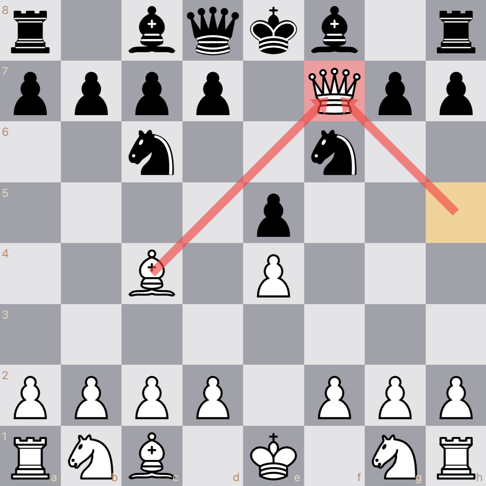
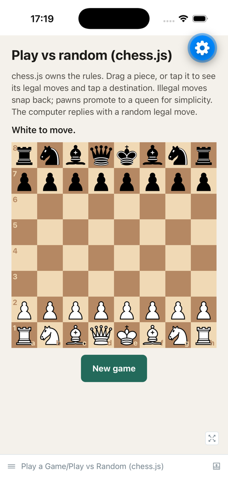
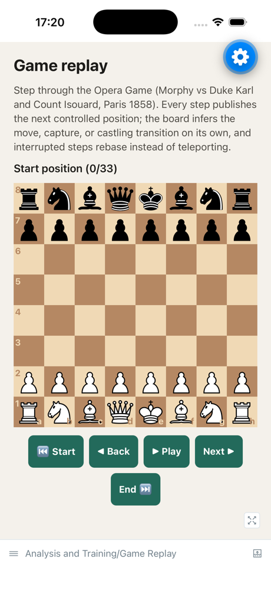
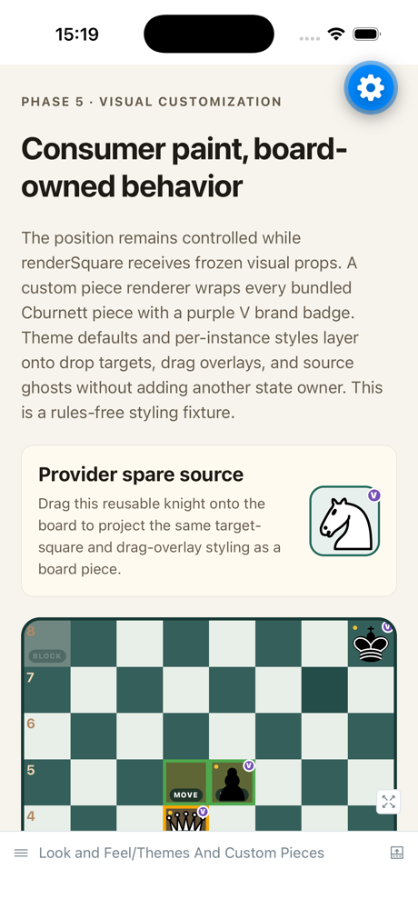

# chessboard-native

<!-- markdownlint-disable MD013 -->

[](https://www.npmjs.com/package/@vibechess/chessboard-native)
[](https://github.com/annabilik/chessboard-native/actions/workflows/ci.yml)
[](LICENSE)

A React Native chessboard with native gestures and animations — bring your own
engine.



`@vibechess/chessboard-native` runs on Android and iOS and targets the useful
surface of pinned `react-chessboard@5.10.0`, with explicit browser-only
exclusions. Your app owns position, annotations, and optional selection; the
board owns only transient presentation and never creates a second semantic
source of truth.

## Highlights

- Responsive standard and rectangular boards with either orientation.
- Strict 8×8 FEN or sparse object positions with an open piece vocabulary.
- Controlled moves, selection, square/arrow annotations, and transitions.
- Native drag, tap, spare-piece, annotation, and adjustable-control input.
- Declarative themes, styles, custom pieces, and visual-only square renderers.
- Bundled Cburnett piece renderers as code-native React Native SVG components.
- Multiple-board coordination without provider-owned chess state.
- A `react-chessboard-compat` entry point for incremental migration.
- ESM package exports verified in clean Expo and bare React Native consumers.

The library does not contain chess rules, legal-move validation, application
state, clocks, engines, networking, or product protocol code. Pair it with a
rules engine you own — the [native Storybook](#gallery-and-native-storybook)
includes a complete chess.js recipe.

## Install

Install the package and its required peers on the supported lines:

```sh
npm install \
  @vibechess/chessboard-native \
  react@19.2.x \
  react-native@0.86.x \
  react-native-gesture-handler@2.32.x \
  react-native-reanimated@4.5.x \
  react-native-svg@15.15.x \
  react-native-worklets@0.10.x
```

| Required peer                  | Supported line |
| ------------------------------ | -------------- |
| `react`                        | `19.2.x`       |
| `react-native`                 | `0.86.x`       |
| `react-native-gesture-handler` | `2.32.x`       |
| `react-native-reanimated`      | `4.5.x`        |
| `react-native-svg`             | `15.15.x`      |
| `react-native-worklets`        | `0.10.x`       |

Mount the app beneath `GestureHandlerRootView`, configure Reanimated/Worklets
for the host app, and give the board a constrained parent width. See the
[package guide](packages/chessboard-native/README.md) for Expo and bare React
Native setup.

## Quick start

```tsx
import { Chessboard } from '@vibechess/chessboard-native';

export function AnalysisBoard() {
  return (
    <Chessboard
      boardId="analysis"
      position="rnbqkbnr/pppppppp/8/8/8/8/PPPPPPPP/RNBQKBNR"
    />
  );
}
```

For an interactive store, use a revisioned position. Recheck the request's base
revision inside a functional update before publishing the next position:

```tsx
import { useState } from 'react';
import {
  Chessboard,
  type ControlledPosition,
  type OnMoveRequest,
} from '@vibechess/chessboard-native';

const initialPosition: ControlledPosition = {
  revision: 0,
  value: { e2: { id: 'white-pawn', pieceType: 'wP' } },
};

export function InteractiveBoard() {
  const [position, setPosition] = useState<ControlledPosition>(initialPosition);

  const onMoveRequest: OnMoveRequest = async (intent, { signal }) => {
    const accepted = await validateMove(intent, signal);
    if (!accepted || signal.aborted) {
      return { status: 'rejected', reason: 'illegal or stale' };
    }

    setPosition((current) =>
      current.revision === intent.basePositionRevision
        ? {
            committedIntentId: intent.intentId,
            revision: current.revision + 1,
            value: applyMove(current.value, intent),
          }
        : current,
    );
    return { status: 'accepted' };
  };

  return (
    <Chessboard
      boardId="analysis"
      onMoveRequest={onMoveRequest}
      position={position}
    />
  );
}
```

Returning `accepted` permits pending presentation only. The board does not
apply the move; the consumer's next `position` prop is the commit.

## Choose an API surface

| Surface                   | Choose it when                                                                                                                                                                             |
| ------------------------- | ------------------------------------------------------------------------------------------------------------------------------------------------------------------------------------------ |
| Primary root API          | You want revision correlation, asynchronous decisions, stable annotation IDs, square annotations, selection, accessibility customization, transitions, providers, or targeted spare pieces |
| `react-chessboard-compat` | You are migrating a `react-chessboard@5.10.0` options object and accept native values and controlled semantics                                                                             |
| `pieces`                  | You only need the bundled Cburnett `defaultPieceRenderers` value; renderer types remain on the root API                                                                                    |

```tsx
import { Chessboard } from '@vibechess/chessboard-native/react-chessboard-compat';

<Chessboard options={{ id: 'analysis', position, arrows }} />;
```

The compatibility adapter keeps familiar names, not browser primitives or
upstream shadow state. Read the migration guide before treating it as a
replacement.

## Versions

| Version        | Status             | Notable surface                                                                       |
| -------------- | ------------------ | ------------------------------------------------------------------------------------- |
| `0.1.0`        | prepared on `main` | First stable-channel release; publishes to npm `latest`                               |
| `0.1.0-next.3` | published          | Bundled Cburnett default piece renderers (CC BY-SA 3.0)                               |
| `0.1.0`        | published          | `react-chessboard-compat` entry point; frozen public API and complete parity evidence |
| `0.1.0-next.1` | published          | npm trusted-publishing (OIDC) proof release                                           |
| `0.1.0-next.0` | published          | Bootstrap release                                                                     |

Versions before `0.1.0-next.3` ship interim geometric placeholder pieces, and
versions before `0.1.0` lack the compatibility entry point. `0.1.0` is
the first stable version intentionally published to the `latest` channel;
`next` continues to track prereleases and may therefore resolve older than
`latest` between cycles.

`0.1.0` is a 0.x release. The API is frozen and the parity ledger is closed,
but the physical-device gates listed in the
[support matrix](docs/support-matrix.md#release-validation-still-pending) —
TalkBack, VoiceOver, visual baselines, gesture and lifecycle matrix,
compatibility matrix, and performance budgets — remain outstanding, and 1.0
production support is still not declared.

## Documentation

| Guide                                                                          | Covers                                                                                     |
| ------------------------------------------------------------------------------ | ------------------------------------------------------------------------------------------ |
| [Documentation index](docs/README.md)                                          | Entry point for every guide                                                                |
| [API reference](docs/api-reference.md)                                         | Entry points, components, controlled contracts, callbacks, defaults, utilities, and errors |
| [Migration from `react-chessboard`](docs/migrating-from-react-chessboard.md)   | Incremental compatibility-subpath and primary-API migration paths                          |
| [Comparison](docs/comparison.md)                                               | Semantic differences from `react-chessboard@5.10.0`                                        |
| [Support and validation matrix](docs/support-matrix.md)                        | Supported lines, platforms, entry points, and the evidence behind each claim               |
| [Pinned parity ledger](docs/parity/react-chessboard-5.10.md)                   | Source-addressed implementation evidence for all pinned exports, options, and behaviors    |
| [Accessibility contract](docs/accessibility.md)                                | The single adjustable control, cursor, announcements, and manual checklists                |
| [Physical accessibility validation](docs/physical-accessibility-validation.md) | Recording and verifying physical TalkBack and VoiceOver evidence                           |
| [Architecture decisions](docs/architecture/invariants.md)                      | The invariant registry and its governing ADRs                                              |
| [Native Storybook](docs/storybook.md)                                          | Running and maintaining the on-device catalog                                              |
| [Release runbook](docs/releasing.md)                                           | Version preparation, dry runs, and trusted publishing                                      |

## Support boundary

The current supported host boundary is Expo SDK 57 or bare React Native 0.86
with React 19.2 and the New Architecture. Android and iOS are the target
platforms. CommonJS, the legacy architecture, and React Native Web are not
supported contracts.

Automated tests and packed-consumer builds are not the same as physical-device
certification. Consult the [support matrix](docs/support-matrix.md) for exact
evidence and the remaining TalkBack, VoiceOver, performance, visual, and device
coverage gates.

## Gallery and native Storybook

The private Expo example app hosts two catalogs:

| Catalog             | Start it               | What it shows                                                                                                                                                                                                                                    |
| ------------------- | ---------------------- | ------------------------------------------------------------------------------------------------------------------------------------------------------------------------------------------------------------------------------------------------ |
| Expo Router gallery | `pnpm example:start`   | Focused labs for every controlled workflow, from move requests to accessibility                                                                                                                                                                  |
| On-device Storybook | `pnpm storybook:start` | A chess-concept catalog: playing against chess.js, validation, promotion and premoves, game replay and puzzles, board-editor palettes, theming, accessibility, and migration, plus an args-driven playground and the complete Cburnett piece set |

```sh
corepack enable
pnpm install --frozen-lockfile
pnpm example:start   # or: pnpm storybook:start
```

| Play vs random (chess.js)                                                   | Game replay                                                           | Themes and custom pieces                                    |
| --------------------------------------------------------------------------- | --------------------------------------------------------------------- | ----------------------------------------------------------- |
|  |  |  |

Simulator captures of three of the eighteen stories; the
[Storybook guide](docs/storybook.md#preview-the-catalog) previews more.

**[Browse the catalog in your browser →](https://chessboard-native.vercel.app)**
The same stories also render on the web through `react-native-web`. That
preview is a demo artifact only: React Native Web is not a supported target,
and gesture, animation, and accessibility fidelity are exactly what a DOM
substitute cannot reproduce, so the on-device catalog stays authoritative. See
[web preview](docs/storybook.md#web-preview-unsupported) for its known gaps.

Gallery source lives in [`apps/example`](apps/example/app/index.tsx). Storybook
is enabled only through its alternate Metro entry point, and normal gallery
bundles remain Storybook-free; the pull-request gate validates the exact pinned
story inventory and exports both catalogs for Android and iOS without running
native builds. The bare React Native harness in
[`apps/native-harness`](apps/native-harness/README.md) supplies
package-resolution, native-build, and deterministic interaction/accessibility
fixtures. See the [Storybook guide](docs/storybook.md) for usage, maintenance,
and deliberate limits.

## Development

The repository pins Node.js 24.15.0 and pnpm 11.11.0.

```sh
corepack enable
pnpm install --frozen-lockfile
pnpm verify
```

Important commands:

| Command                             | Purpose                                                                                    |
| ----------------------------------- | ------------------------------------------------------------------------------------------ |
| `pnpm check`                        | Formatting, lint, docs, types, Jest, tooling, and parity evidence                          |
| `pnpm verify`                       | Complete pull-request gate, including build, API, package, release, and Expo export checks |
| `pnpm accessibility:evidence:check` | Validate the recorded physical-evidence record and checklist coverage                      |
| `pnpm api:check`                    | Compare declarations with all three checked-in API reports                                 |
| `pnpm package:check`                | Inspect one packed archive with Publint and Are The Types Wrong                            |
| `pnpm parity:verify`                | Rebuild executable parity evidence and validate the ledger                                 |
| `pnpm example:export`               | Export Android and iOS Expo gallery bundles                                                |
| `pnpm storybook:check`              | Regenerate and validate the exact native Storybook inventory                               |
| `pnpm storybook:export`             | Export Android and iOS Storybook bundles without native builds                             |

See [CONTRIBUTING.md](CONTRIBUTING.md) for local workflow and pull-request
requirements. Security reports follow [SECURITY.md](SECURITY.md).

## Parity and release status

The compatibility target is frozen to `react-chessboard@5.10.0`, commit
`b74704af988396d3da32a8c1627d95341e1e0061`. Its reviewed source fixture and
licensing are kept under
[`fixtures/parity/upstream-b74704a`](fixtures/parity/upstream-b74704a/PROVENANCE.md)
for offline evidence; the fixture directory is never included in the npm
archive. The bundled default renderers port Colin M.L. Burnett's Cburnett
artwork, attributed to the individual Wikimedia Commons files recorded in
[THIRD_PARTY_NOTICES.md](THIRD_PARTY_NOTICES.md), into code-native React Native
components; `0.1.0-next.3` was the first version that shipped them. No
fixture file is imported or shipped by the package.

The machine-readable ledger covers all 39 root exports, 42 options, and 50
reviewed behaviors. Required parity validation runs the complete gate: all 131
rows must be marked implemented, with exactly one passing executable contract
for every contract ID. That total includes ten negative contracts that lock
intentional browser-only exclusions. This closes the pinned native parity
target; it does not claim a drop-in browser replacement, React Native Web
support, or production readiness.

Merging does not publish. A manual protected workflow builds and inspects one
archive, performs a registry-safe dry run by default, and publishes through npm
trusted OIDC only when explicitly requested; the release process is npm
dist-tag based and is documented in the [release runbook](docs/releasing.md).

## License

Project code is available under the [MIT License](LICENSE). The built-in
Cburnett chess-piece artwork and its adaptation are separately available under
CC BY-SA 3.0. Attribution, source links, change notices, and the artwork license
boundary are recorded in [NOTICE.md](NOTICE.md) and
[THIRD_PARTY_NOTICES.md](THIRD_PARTY_NOTICES.md); standalone copies of the
notice and license are included in the published package.
