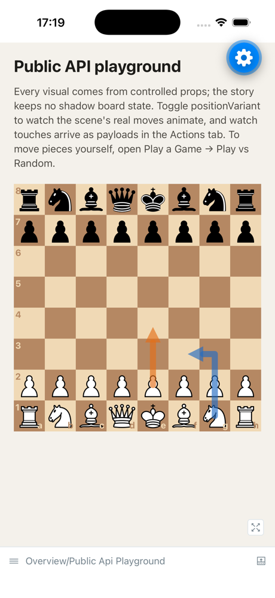
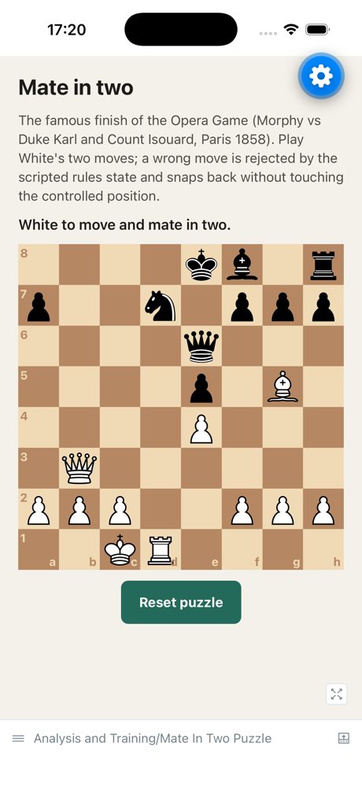
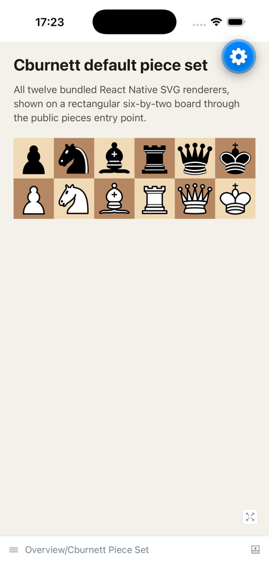

# Native Storybook

The private Expo example app also hosts the library's on-device Storybook. It
is a searchable, interactive catalog for the standalone
`@vibechess/chessboard-native` package; it does not import or run any VibeChess
application code.

Storybook is an alternate Metro entry point. With `STORYBOOK_ENABLED=true`,
Metro starts `.rnstorybook/index.tsx`. Without that variable, the wrapper is a
strict no-op and the existing Expo Router gallery starts normally. No
Storybook module enters the normal gallery bundle.

There are two ways to meet the catalog: browse the static previews below, or
run the real thing on a device or simulator.

## Preview the catalog

These are unmodified iOS simulator captures of the stories, regenerated from
the live catalog (see [Refresh the previews](#refresh-the-previews)). They are
stills: the drag, animation, and accessibility behaviour that the catalog
exists to demonstrate only exists on a device.

<!-- markdownlint-disable MD013 -->

| Public API playground                                             | Play vs random (chess.js)                                    |
| ----------------------------------------------------------------- | ------------------------------------------------------------ |
|    |  |
| Args-driven tour of real-chess scenes, themes, and reduced motion | chess.js validates every move through `onMoveRequest`        |

| Game replay                                            | Mate in two                                                 |
| ------------------------------------------------------ | ----------------------------------------------------------- |
|  |       |
| The Opera Game, one controlled position per ply        | The same game's forced finish, with snapback on wrong moves |

| Themes and custom pieces                                       | Cburnett piece set                                                |
| -------------------------------------------------------------- | ----------------------------------------------------------------- |
|  |  |
| Board theming with visual-only `renderSquare` content          | The twelve bundled renderers on a rectangular board               |

<!-- markdownlint-enable MD013 -->

There is no hosted browser Storybook. Rendering this catalog in a browser
would require `react-native-web`, which is outside the current support
contract, and the board's gestures, Reanimated transitions, and single-control
accessibility surface are exactly the parts a DOM substitute cannot
demonstrate faithfully. See the
[support matrix](./support-matrix.md) for the platform boundary and
[Deliberate limits](#deliberate-limits) below.

## Run it

Install the pinned workspace dependencies once:

```sh
corepack enable
pnpm install --frozen-lockfile
```

Start Storybook:

```sh
pnpm storybook:start
```

Then press `i` for the iOS simulator or `a` for an Android emulator. The Expo
terminal can also display a QR code for a compatible device runtime. The story
picker remembers the last selected story on that device.

To open a platform directly from the example package, use:

```sh
pnpm --filter @vibechess/chessboard-native-example storybook:ios
pnpm --filter @vibechess/chessboard-native-example storybook:android
```

The example app uses only libraries bundled with Expo Go, so a phone running a
matching Expo Go can open the printed QR code without a custom build. If port
8081 is already taken by another checkout, pass `--port`:

```sh
cd apps/example && STORYBOOK_ENABLED=true npx expo start --port 8082
```

### Jump straight to one story

The runner reads a `STORYBOOK_STORY_ID` query parameter from the URL the app
was opened with, which selects that story instead of the persisted one. This is
useful for reviewing a single story and is what the preview-capture script
uses:

```sh
xcrun simctl openurl booted \
  'exp://127.0.0.1:8082/--/?STORYBOOK_STORY_ID=play-a-game--play-vs-random'
```

Story IDs are the values pinned in `fixtures/storybook/required-stories.json`.

### Refresh the previews

The screenshots in [Preview the catalog](#preview-the-catalog) are regenerated
from the running catalog, so they cannot silently drift from it. With Storybook
running on port 8082 and an iOS simulator booted:

```sh
apps/example/scripts/capture-storybook-screenshots.sh
```

Pass a story ID and file name to capture one story
(`… play-a-game--play-vs-random play-vs-random`). Recapture after any change
that alters what a featured story looks like, and commit the updated PNGs.
Recording interaction video additionally requires driving the gestures by hand
alongside `xcrun simctl io booted recordVideo`; that pass is manual.

### Installable builds

Sharing a runnable catalog with someone who will not clone the repository
needs a real build, because Expo Go cannot load
[EAS Update](https://docs.expo.dev/eas-update/introduction/) payloads — those
require a custom build containing `expo-updates`, which this private example
app deliberately does not include. The two documented options, both requiring
an Expo account and neither currently wired up, are an EAS Build
internal-distribution Android artifact (installable from a link or QR) and a
TestFlight or ad-hoc iOS build. Adopt one only alongside the maintenance cost
of keeping it current.

## Catalog scope

The catalog is organized by chess-product concept, so a consumer finds the
feature they are building rather than the library's internal taxonomy. Every
story title names a chess concept; every story note names the concept first
and then the public APIs that implement it. The required inventory is pinned
in `fixtures/storybook/required-stories.json` and covers these sections:

- **Overview** — an args-driven public API playground over three real-chess
  scenes (the starting position, the Scholar's Mate threat, and a ladder mate
  on a rectangular board; the `positionVariant` arg animates each scene's
  verified moves, and observational callbacks stream to the Actions tab), and
  all twelve bundled Cburnett piece renderers.
- **Play a Game** — the "using with chess.js" recipe (chess.js validates
  inside `onMoveRequest`, legal-move hints flow through `selection`, and a
  random opponent replies with revisioned positions), move validation with
  decision/commit timeouts, selection and legal-move hints, rules-owned
  promotion and premoves, and move animation with special moves.
- **Analysis and Training** — analysis arrows and highlights, Opera Game
  replay, and the Opera Game's forced finish as a mate-in-two puzzle.
- **Board Setup and Variants** — a spare-piece board-editor palette and
  cross-board drag through one explicit provider.
- **Look and Feel** — themes and custom pieces, piece touch feedback, and
  square press feedback.
- **Accessibility** — screen-reader play as one adjustable control.
- **Migration** — familiar `react-chessboard` names over the controlled
  pipeline.
- **Engineering Lab** — the interaction-hardening QA stress lab, deliberately
  kept outside the chess-concept sections.

Most stories reuse the same public example screens as the Expo Router
gallery; the chess.js-powered recipes live in `apps/example/src` as
Storybook-only screens. chess.js is a dependency of the private example app
only — the published package stays rules-free. Every board position is real
chess: replayed lines are validated by chess.js at bundle time, and arrows,
destinations, and highlights depict legal, thematically correct moves. The
gallery index itself is not a story because Storybook already provides
navigation.

Some stories are intentionally manual labs. Timers, native gestures,
accessibility speech, lifecycle changes, and performance behavior cannot be
certified by a static story index or Metro export. The support matrix remains
authoritative for physical-device evidence.

Type-only exports, pure coordinate/FEN helpers, and deliberate development
error paths have no meaningful native visual state. Their API documentation
and deterministic tests remain the authoritative demonstrations instead of
manufacturing placeholder stories.

## Add or rename a story

Story source lives in `apps/example/stories`. After changing the story glob,
device addons, or Storybook configuration, regenerate the committed native
entry:

```sh
pnpm --filter @vibechess/chessboard-native-example storybook:generate
```

Do not edit `.rnstorybook/storybook.requires.ts` by hand. Add the stable story
ID to `fixtures/storybook/required-stories.json`, then run:

```sh
pnpm storybook:check
```

That check regenerates the entry and fails if it was stale. It also builds the
CSF index through Storybook's public Node API and requires the exact committed
story inventory, with no missing or accidental stories.

## Bundle validation

The pull-request gate exports four Metro bundles:

```sh
pnpm example:export
pnpm storybook:export
```

The first command exports normal Android and iOS gallery bundles with
Storybook disabled. The second exports the native Storybook entry for both
platforms. These are JavaScript bundle gates; they do not run Xcode or Gradle
native builds.

## Deliberate limits

This repository currently supports Android and iOS, not React Native Web.
Consequently, this slice does not publish a hosted browser Storybook; the
committed previews above are the browser-visible substitute. A web catalog,
automated gesture traversal, and screenshot baselines should each be separate
changes after their support and maintenance costs are accepted.

The committed previews are documentation, not a visual-regression baseline.
Nothing fails when they age, so refresh them deliberately with the capture
script when a featured story changes. This is the observed ecosystem pattern
for interaction-heavy native libraries — published docs with recorded media
plus a runnable example app — rather than a hosted interactive catalog, which
in practice requires the react-native-web support this project excludes.

The setup follows the official
[React Native Storybook project](https://github.com/storybookjs/react-native)
and its
[Expo Router entry-point guidance](https://storybookjs.github.io/react-native/docs/intro/getting-started/).
